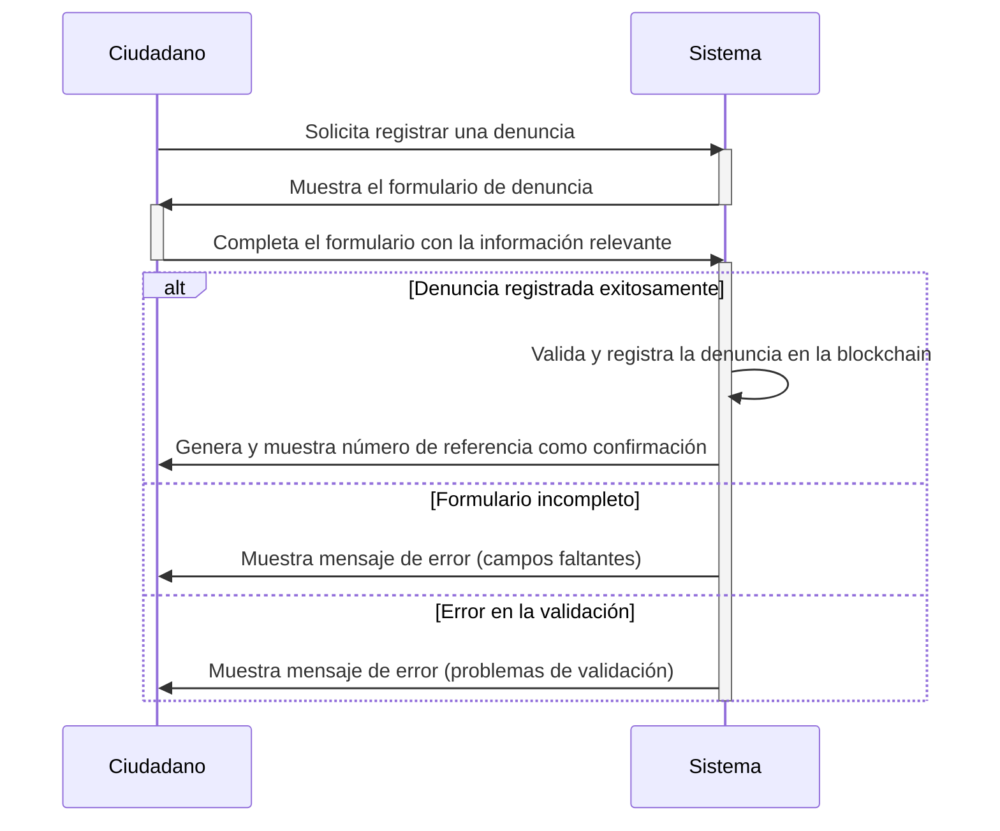
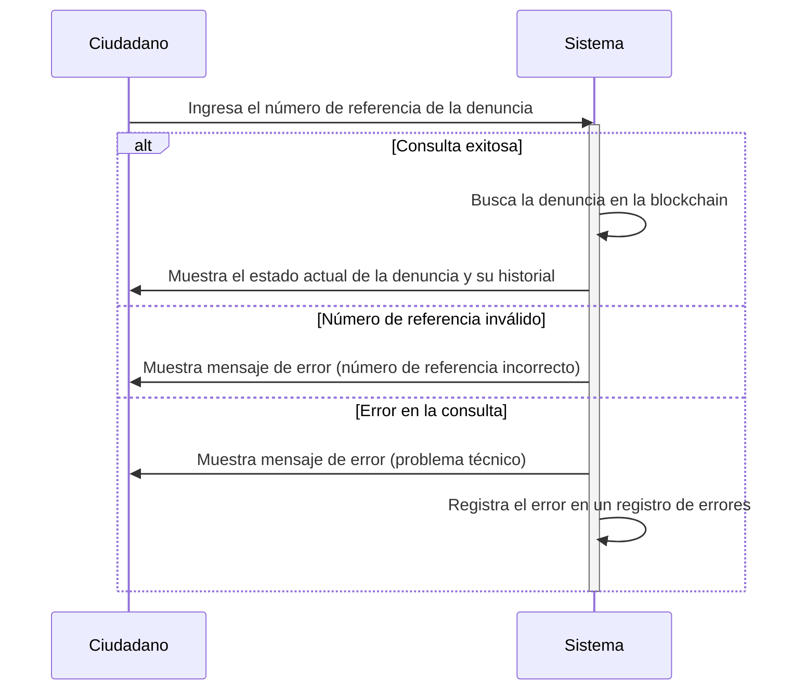
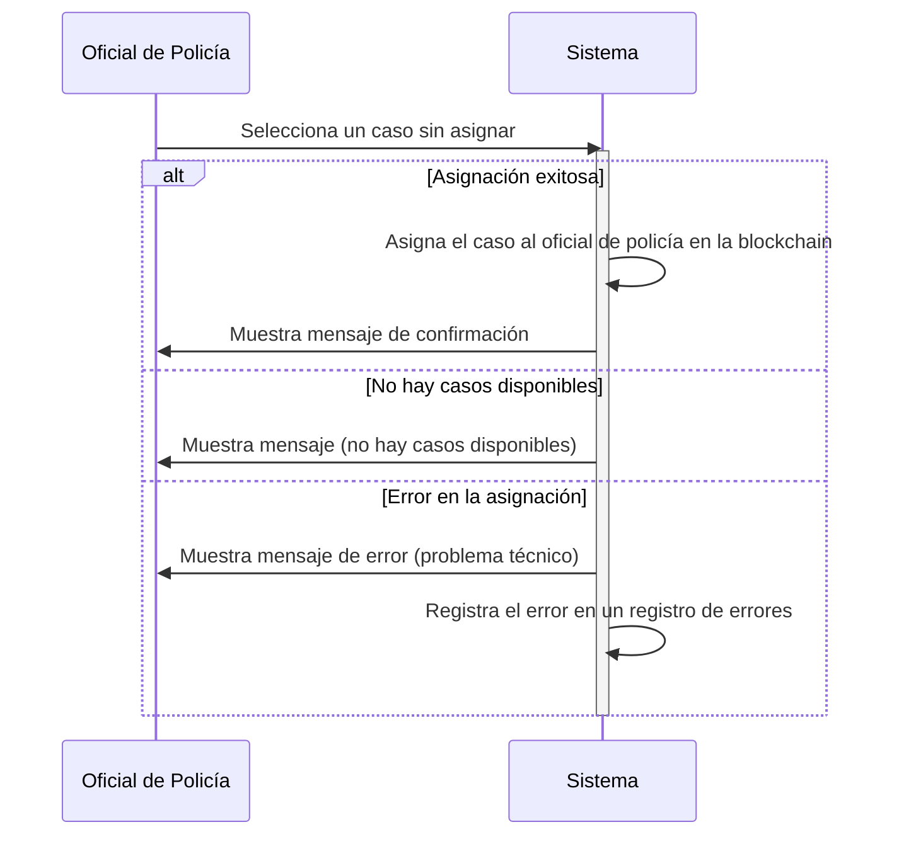
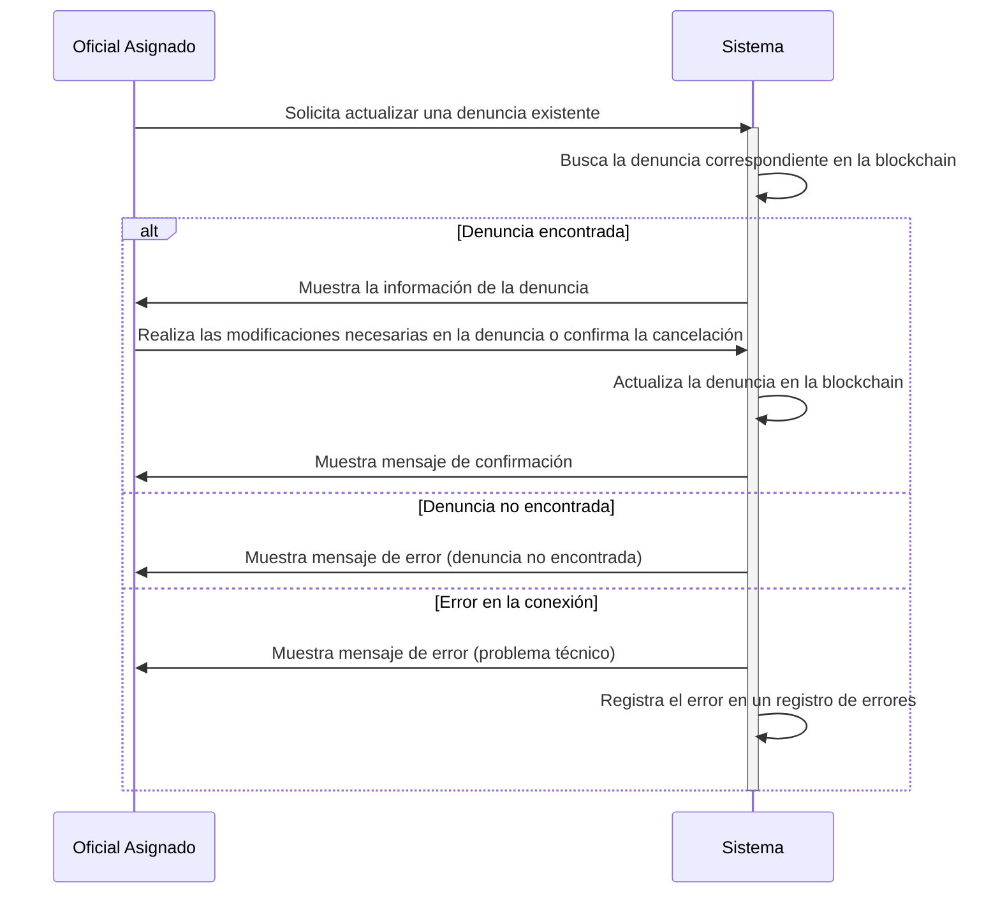
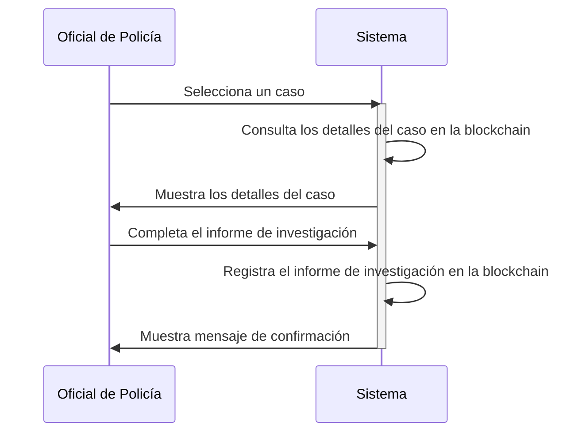
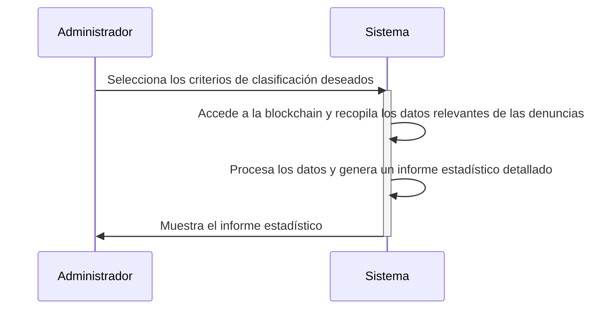

# Índice de Diagramas de Secuencia

1. [ECU-01: Registrar denuncia](#ecu-01-registrar-denuncia)
2. [ECU-02: Consultar estado e historial de denuncia](#ecu-02-consultar-estado-e-historial-de-denuncia)
3. [ECU-03: Asignar caso a un oficial de policía](#ecu-03-asignar-caso-a-un-oficial-de-policía)
4. [ECU-04: Actualizar denuncia](#ecu-04-actualizar-denuncia)
5. [ECU-05: Generar informe de investigación [Trabajo futuro]](#ecu-05-generar-informe-de-investigación-trabajo-futuro)
6. [ECU-06: Generar reporte estadístico [Trabajo futuro]](#ecu-06-generar-reporte-estadístico-trabajo-futuro)

---

## ECU-01: Registrar denuncia

**Descripción:** Permite a los usuarios registar una denuncia policial proporcionando la información requerida.

**Actor(es):** Ciudadano, oficial de policía

**Pre-condiciones:** Ninguna

Enlaces:
* [Especificación de caso de uso](use-case-specification.md#ecu-01-registrar-denuncia)
* [Diagrama de clase](class-diagram.md#ecu-01-registrar-denuncia)

[Volver al índice](#índice-de-diagramas-de-secuencia)

---

## ECU-02: Consultar estado e historial de denuncia

**Descripción:** Permite a los usuarios verificar el estado actual y el historial de una denuncia registrada anteriormente.

**Actor(es):** Ciudadano

**Pre-condiciones:** El ciudadano debe tener un número de referencia de denuncia válido.

Enlaces:
* [Especificación de caso de uso](use-case-specification.md#ecu-02-consultar-estado-e-historial-de-denuncia)
* [Diagrama de clase](class-diagram.md#ecu-02-consultar-estado-e-historial-de-denuncia)

[Volver al índice](#índice-de-diagramas-de-secuencia)

---

## ECU-03: Asignar caso a un oficial de policía

**Descripción:** Permite a los funcionarios de policía asignar casos de denuncia a oficiales específicos para su investigación.

**Actor(es):** Oficial de policía

**Pre-condiciones:** El caso de denuncia debe estar disponible y sin asignar.

Enlaces:
* [Especificación de caso de uso](use-case-specification.md#ecu-03-asignar-caso-a-un-oficial-de-policía)
* [Diagrama de clase](class-diagram.md#ecu-03-asignar-caso-a-un-oficial-de-policía)

[Volver al índice](#índice-de-diagramas-de-secuencia)

---

## ECU-04: Actualizar denuncia

**Descripción:** Permite al oficial asignado actualizar una denuncia policial existente.

**Actor(es):** Oficial asignado

**Pre-condiciones:** El oficial asignado debe tener los permisos necesarios y la denuncia debe existir previamente.

Enlaces:
* [Especificación de caso de uso](use-case-specification.md#ecu-04-actualizar-denuncia)
* [Diagrama de clase](class-diagram.md#ecu-04-actualizar-denuncia)

[Volver al índice](#índice-de-diagramas-de-secuencia)

---

## ECU-05: Generar informe de investigación [Trabajo futuro]

**Descripción:** Permite a los oficiales de policía generar un informe detallado sobre la investigación realizada en un caso específico.

**Actor(es):** Oficial de policía

**Pre-condiciones:** El oficial de policía debe tener acceso al caso de denuncia y haber completado la investigación.

Enlaces:
* [Especificación de caso de uso](use-case-specification.md#ecu-05-generar-informe-de-investigación-trabajo-futuro)
* [Diagrama de clase](class-diagram.md#ecu-05-generar-informe-de-investigación-trabajo-futuro)

[Volver al índice](#índice-de-diagramas-de-secuencia)

---

## ECU-06: Generar reporte estadístico [Trabajo futuro]

**Descripción:** Permite a los administradores del sistema generar informes estadísticos sobre las denuncias presentadas.

**Actor(es):** Administrador

**Pre-condiciones:** El administrador debe tener acceso autorizado al sistema.

Enlaces:
* [Especificación de caso de uso](use-case-specification.md#ecu-06-generar-reporte-estadístico-trabajo-futuro)
* [Diagrama de clase](class-diagram.md#ecu-06-generar-reporte-estadístico-trabajo-futuro)

[Volver al índice](#índice-de-diagramas-de-secuencia)
